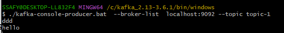
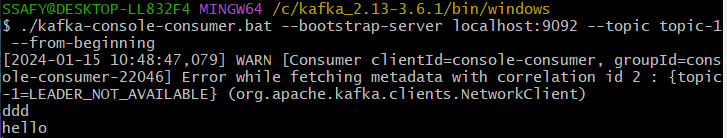
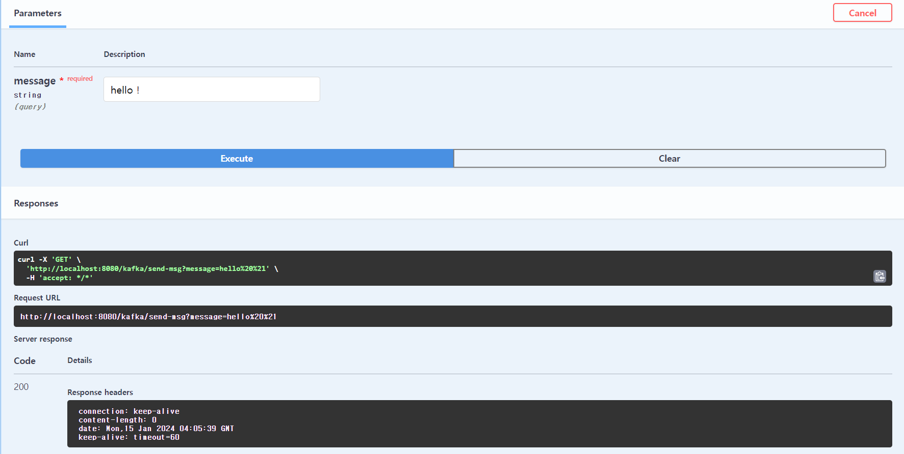
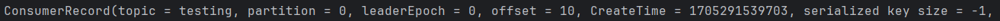
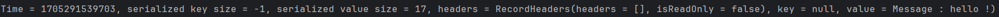

## Apache Kafka

- 이벤트 스트리밍 플랫폼
- Pub(Producer) - Sub(Consumer) 모델의 메세지 큐 형태로 사용
- Rabbit MQ와 같은 Message Broker(메세지 전달자)와 같은 역할 수행 가능
- 큐에서 데이터를 짧은 시간을 제거하는 Message Broker와 다르게, Kafka와 같은 Event Broker는 바로 이벤트를 삭제하지 않으므로 장애가 해결된 이후 다시 Consume 가능.

### Apache Zookeeper 및 Kafka 설치

- Apache Kafka를 이용하기 위해서는 Apache Zookeeper가 필요하다.
- Zookeeper로 부터 의존성을 제거 중. (24.01.15)
- Zookeeper는 Kafka (클러스터) 들을 관리해주는 관리 프로그램.
- [Apache Zookeeper](https://zookeeper.apache.org/releases.html) (3.8.3)
- [Apache Kafka](https://kafka.apache.org/downloads) (kafka_2.13-3.6.1.tgz)

### Apache Zookeeper 사용

설치한 Kafka 디렉토리의 `bin/windows` 로 가서 Shell을 연다.

- Zookeeper 실행 (실행 시에 설정 파일을 같이 지정해줘야 한다.)
  - `./zookeeper-server-start.bat ../../config/zookeeper.properties`
  - 기본 포트는 2181로 할당.

### Apache Kafka 사용

동일한 디렉토리에서 쉘을 하나 더 연다.

#### Kafka 실행 (실행 시에 설정 파일을 같이 지정해줘야 한다.)

- `./kafka-server-start.bat ../../config/server.properties`
- 기본 포트는 9092로 할당.
- `netstat -a` 로 포트 상태 확인 가능

#### Topic 생성

- Topic은 일종의 데이터 파이프라인.
- Create로 파이프라인을 생성하고, Producer는 해당 토픽으로 데이터를 밀어넣고 Consumer는 토픽을 구독한다.
- `topic-1` 이라는 토픽을 생성해보자.  
  `./kafka-topics.bat --create --bootstrap-server localhost:9092 --topic topic-1`\
- 새로운 쉘을 두 개 열고 각각 다음의 Line을 적어 topic에 데이터를 push할 준비를 한다.
  `./kafka-console-producer.bat  --broker-list  localhost:9092 --topic topic-1`
  `./kafka-console-consumer.bat --bootstrap-server localhost:9092 --topic topic-1 --from-beginning`

#### 프로듀서 이미지



#### 컨슈머 이미지



### Spring Boot와 연동

#### 의존성 추가

1. build.gradle에 추가합니다.

- `implementation 'org.springframework.kafka:spring-kafka'`

2. Configuration

- Producer

  ```java
  @Configuration
  public class KafkaProducerConfig {

      @Bean
      public ProducerFactory<String, Object> producerFactory() {
          Map<String, Object> config = new HashMap<>();
          // Producer가 처음으로 연결할 Kafka 브로커의 위치 설정
          config.put(ProducerConfig.BOOTSTRAP_SERVERS_CONFIG, "localhost:9092");

          // 송신 데이터(key, value) 직렬화
          config.put(ProducerConfig.KEY_SERIALIZER_CLASS_CONFIG, StringSerializer.class);
          config.put(ProducerConfig.VALUE_SERIALIZER_CLASS_CONFIG, StringSerializer.class);

          return new DefaultKafkaProducerFactory<>(config);
      }

      @Bean
      public KafkaTemplate<String, Object> kafkaTemplate() {
          return new KafkaTemplate<>(producerFactory());
      }
  }
  ```

- Comsumer

  ```java
  @Configuration
  public class KafkaConsumerConfig {

      @Bean
      public ConsumerFactory<String, Object> consumerFactory() {
          Map<String, Object> config = new HashMap<>();

          // Consumer의 Kafka 연결
          config.put(ConsumerConfig.BOOTSTRAP_SERVERS_CONFIG, "localhost:9092");
          config.put(ConsumerConfig.GROUP_ID_CONFIG, "group_1");
          // 데이터 역직렬화
          config.put(ConsumerConfig.KEY_DESERIALIZER_CLASS_CONFIG, StringDeserializer.class);
          config.put(ConsumerConfig.VALUE_DESERIALIZER_CLASS_CONFIG, StringDeserializer.class);

          return new DefaultKafkaConsumerFactory<>(config);
      }

      /*
      @KafkaListener 어노테이션이 붙은 메서드에 주입되어 사용.
      메시지를 동시에 처리할 수 있는 메시지 리스너 컨테이너를 생성.
      */
      @Bean
      public ConcurrentKafkaListenerContainerFactory<String, Object> kafkaListenerContainerFactory() {
          ConcurrentKafkaListenerContainerFactory<String, Object> factory = new ConcurrentKafkaListenerContainerFactory<>();
          factory.setConsumerFactory(consumerFactory());

          return factory;
      }
  }
  ```

3. Component 작성

   - Producer

   ```java
   @Component
   public class TestProducer {

       private final KafkaTemplate<String, Object> kafkaTemplate;

       public TestProducer(KafkaTemplate<String, Object> kafkaTemplate) {
           this.kafkaTemplate = kafkaTemplate;
       }

       public void create(String message) {
           // Topic + Message
           kafkaTemplate.send("testing", "Message : " + message);
       }
   }
   ```

   - Consumer

   ```java
   @Component
   public class TestConsumer {
       // 구독 토픽
       @KafkaListener(topics = "testing", groupId = "group_1")
       public void listener(Object data) {
           System.out.println(data);
       }
   }
   ```

4. Test

   - Boot 3 부터는 Swagger 대신 OpenAPI 사용
   - 아래와 같은 의존성 사용
   - `implementation 'org.springdoc:springdoc-openapi-starter-webmvc-ui:2.3.0'`

   ```java
   @RestController
   @RequestMapping("/kafka")
   public class TestController {

       @Autowired
       private TestProducer testProducer;

       @GetMapping("send-msg")
       public void sendMsg(String message) {

           testProducer.create(message);
       }
   }
   ```

   - 테스트 문구 입력
     
   - 결과 확인
     
     
